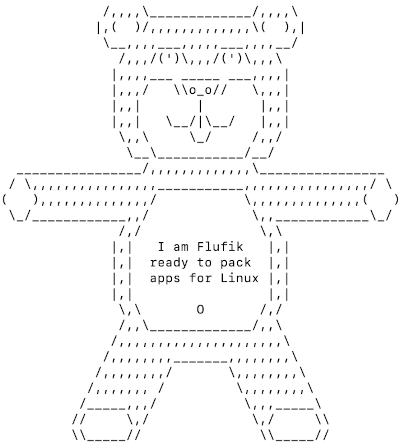

# flufik
Flufik helps to pack your application

# Detailed documentation

<b>Flufik installation</b>

- [Flufik Installation: Manual on Linux, MacOS or installation using yum, apt-get](docs/installation.md)

<b>Naming Convention</b>
- [RPM and DEB packages naming convention](docs/build/naming-convention.md)

<b>RPM</b>
- [Basic package build](docs/build/rpm/basic.md)
- [Advanced package build](docs/build/rpm/advanced.md)
- [Full config packaging options](docs/build/rpm/available%20configuration.md)

<b>DEB</b>
- [Basic package build](docs/build/deb/basic.md)
- [Advanced package build](docs/build/deb/advanced.md)
- [Full config packaging options](docs/build/deb/available%20configuration.md)

<b>Upload</b>
>Currently upload feature is implemented for jfrog repository, nexus and other
> will be available
- [JFrog Repository](docs/upload/jfrog%20repository/jfrog.md)

> Flufik can build rpm and deb packages, more packages will come soon

To easely compile and archive binaries, art cli tool was used: https://github.com/gatblau/artisan/releases/tag/v1.0
